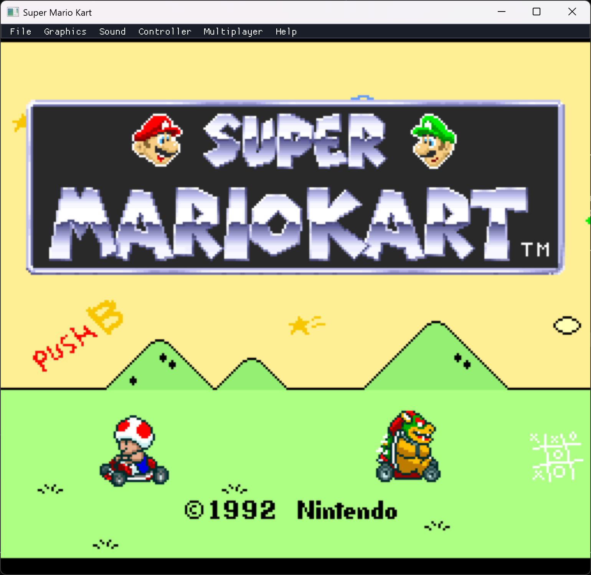
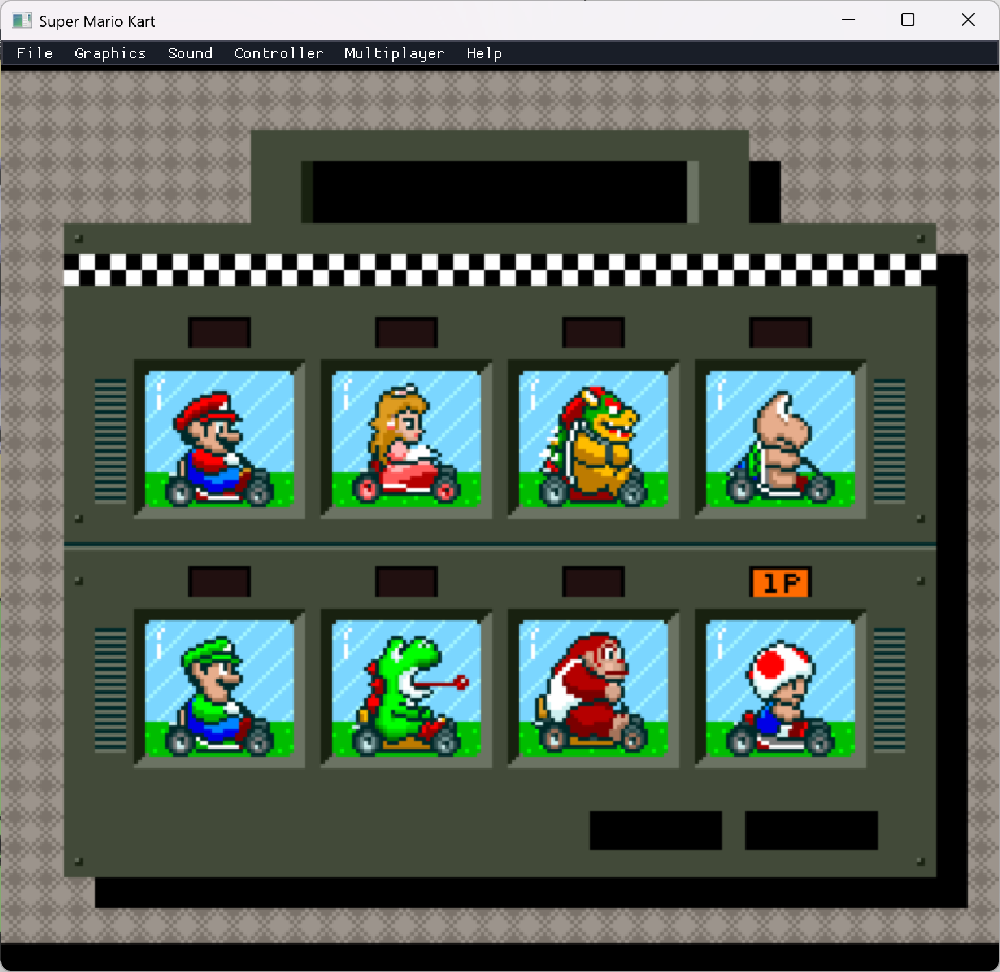
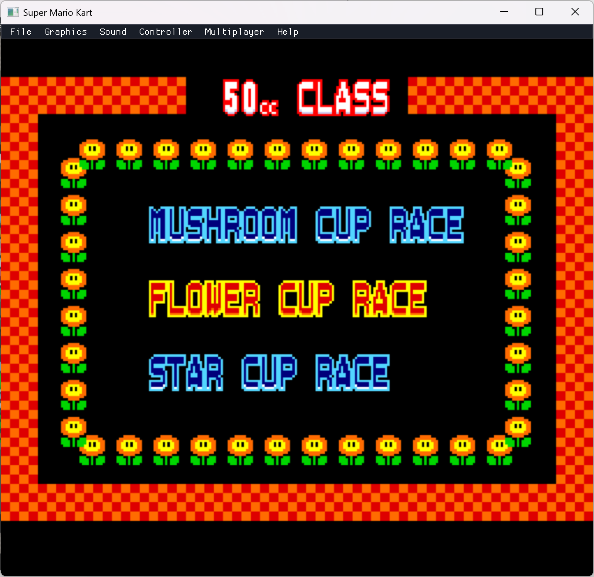
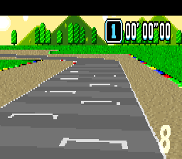

# Super Mario Kart — Static Recompilation

Static recompilation of **Super Mario Kart** (SNES, 1992) from WDC 65C816 assembly to native C code, playable on modern hardware via SDL2.

Part of the [sp00nznet](https://github.com/sp00nznet) recompilation portfolio. This is the first SNES (65816 CPU) target in the series.

## Status

**48 recompiled functions** — game boots through the title screen with full rendering, accepts joypad input, and transitions through the mode select and character select screens. DSP-1 coprocessor fully emulated via LakeSnes HLE backend.

All recompiled functions are defined with `RECOMP_PATCH(name, snes_addr) { ... }` and auto-register in snesrecomp's dispatch table at static-init time — adding a new translated function is a one-line change at the definition site, no central list to maintain.



The full menu flow runs from controller input — title → driver select → class/cup select:





The Mode-7 race renders too — perspective track, lane markings, scenery, and HUD:



A Dear ImGui menu bar (File / Graphics / Sound / Controller / Multiplayer / Help) overlays the game — see [Menu](#menu).

### What works
- Full boot chain: reset vector → hardware init → WRAM clear → PPU/APU/DSP-1 setup → Mode 7 angle table
- NMI handler with state dispatch, brightness fading, OAM DMA
- Main loop with state machine (idle → init → title → mode select → character select)
- Custom tile/tilemap decompressor ($84:E09E) — all 7 compression modes + E0+ extended counts
- Title screen transition: PPU register setup, VRAM tile/tilemap loading, palette decompression
- Real palette data loaded from ROM → CGRAM (256 colors)
- All 3 BG layers rendering correctly (Mode 1: title banner, hills, text)
- Sprite tile DMA pipeline: per-frame staging buffer → NMI DMA consumer → VRAM
- 8-slot sprite animation state machine with Y interpolation and phase milestones
- OAM builder: sprite slots → screen coords → OAM entries with proper tile/attr/priority
- Joypad input: SDL keyboard → SNES auto-joypad → WRAM with edge detection
- HDMA channel 1: indirect mode window masking ($2126/$2127)
- Mode select screen (state $14): graphics decompression, PPU init, simple menu input
- Mode select OAM offscreen filler ($81:94C2 equivalent) — slots 4-127 pinned to Y=$E0 so leftover title-screen sprites don't bleed onto mode select
- Character select screen (state $06): PPU Mode 0, tile DMA, palette loading, 8-character grid navigation with D-pad, confirm/cancel, transition trigger
- SRAM checksum validation and save data erase menu (button-gated, matching original logic)
- LakeSnes PPU renders all 224 scanlines per frame
- SDL2 window at 768×672 (3× scale), 60fps vsync, keyboard input

### What's next
- Mode select menu text (GP / Match Race / Battle Mode) — open investigation. ROM analysis confirms the state $14 handler only places 4 large (16x16) sprites forming a 64x16 selection frame and sets TM=$10 (OBJ-only), so text source remains unidentified. A scheduled research agent is auditing the Yoshifanatic1 and jvipond disassemblies to narrow the hypothesis space.
- Character portraits on the character select grid
- Race screen (Mode 7 rendering, DSP-1 projection math, full gameplay — DSP-1 HLE backend now active)

### Recent (April 2026)
- **Auto-registered dispatch** via `RECOMP_PATCH(name, snes_addr) { ... }` — replaced central `smk_register_all()` boilerplate with linker-priority static constructors. Pattern inspired by N64Recomp's `RECOMP_PATCH`. See [snesrecomp/recomp_patch.h](https://github.com/sp00nznet/snesrecomp/blob/main/include/snesrecomp/recomp_patch.h).
- **Public 65816 op kit** — `<snesrecomp/cpu_ops.h>` promoted out of game-private space. Any SNES recomp project linking snesrecomp now has `op_lda_*`, `op_sta_*`, `op_rep`, `op_php`/`op_plp`, … available as inline helpers.

## Architecture

```
┌─────────────────────────────────────────────────┐
│                 smk_launcher                      │
│  ┌──────────────────────────────────────────┐    │
│  │  src/recomp/ — 48 Recompiled functions   │    │
│  │  smk_boot.c  — NMI, state machine, input │    │
│  │  smk_init.c  — Init, transition dispatch │    │
│  │  smk_title.c — Decompressor, PPU, menus  │    │
│  └──────────────────────────────────────────┘    │
│                       │                           │
│              bus_read8 / bus_write8               │
│                       │                           │
│  ┌──────────────────────────────────────────┐    │
│  │  snesrecomp (ext/snesrecomp/)            │    │
│  │  ┌────────────────────────────────────┐  │    │
│  │  │  LakeSnes — Cycle-accurate SNES HW │  │    │
│  │  │  Real PPU (Mode 0-7, sprites, etc) │  │    │
│  │  │  Real SPC700 + DSP audio           │  │    │
│  │  │  Real DMA (GPDMA + HDMA)           │  │    │
│  │  │  Full memory bus routing            │  │    │
│  │  └────────────────────────────────────┘  │    │
│  │  SDL2 platform (window, audio, input)    │    │
│  └──────────────────────────────────────────┘    │
└─────────────────────────────────────────────────┘
```

Recompiled game code acts as the CPU — it calls `bus_read8(bank, addr)` / `bus_write8(bank, addr, val)` which route through LakeSnes's real memory bus to the actual PPU, APU, DMA, and cartridge hardware. The PPU renders scanlines, the APU processes audio, and DMA transfers happen exactly as on real hardware.

## Controls

Default Player 1 keyboard (rebindable in the menu):

| Key | SNES Button |
|-----|-------------|
| Arrow keys | D-pad |
| Z | B |
| X | Y |
| A | A |
| S | X |
| Q | L |
| W | R |
| Enter | Start |
| Right Shift | Select |
| Escape | Quit |

**Gamepads** (Xbox-style, via SDL_GameController) work out of the box for both
players — A→B, B→A, X→Y, Y→X, shoulders→L/R, Back→Select, Start→Start, d-pad and
left stick steer.

## Menu

A Dear ImGui menu bar (modelled on [LinksAwakening](https://github.com/sp00nznet/LinksAwakening))
overlays the game:

- **File** — New / Save / Load config (`smk_config.ini`), Quit
- **Graphics** — window scale, V-Sync, texture filter, scanlines, show FPS
- **Sound** — master volume, mute
- **Controller** — rebind keyboard **and** gamepad for **Player 1 and Player 2**
- **Multiplayer** — placeholder (long-term stretch goal)
- **Help → About** — links back to this repository

The menu auto-disables in headless/scripted runs (`SMK_HEADLESS`/`SMK_SCRIPT`).

## Building

### Prerequisites
- CMake 3.16+
- Visual Studio 2022 (MSVC)
- SDL2 via vcpkg: `vcpkg install sdl2:x64-windows`
- Python 3.10+ (for disassembler and analysis tools)

### Build

```bash
cmake -B build -G "Visual Studio 17 2022" -A x64 \
  -DCMAKE_TOOLCHAIN_FILE=C:/vcpkg/scripts/buildsystems/vcpkg.cmake

cmake --build build --config Debug
```

### Run

```bash
build/Debug/smk_launcher.exe
```

The ROM file is not included — supply your own US v1.0 copy (MD5: `7f25ce5a283d902694c52fb1152fa61a`).

By default the launcher runs in **real-frame mode** — the genuine ROM via LakeSnes's
full cycle-accurate frame — so menus *and* the Mode-7 race render and play at full
speed out of the box. (The recompiled per-frame shells can't yet drive the race's
multi-frame setup; as gameplay functions are recompiled they take over.)

For recompilation development, use the recompiled-shell path:

```bash
SMK_SHELLS=1 build/Debug/smk_launcher.exe           # recompiled per-frame shells
```

## Decompressor

The custom decompressor at `$84:E09E` handles SMK's tile/tilemap compression format:

| Mode | Encoding | Description |
|------|----------|-------------|
| `$00` | Raw | Copy N bytes from stream |
| `$20` | RLE | Repeat 1 byte N times |
| `$40` | Word fill | Alternate 2 bytes for N entries |
| `$60` | Inc fill | Store incrementing byte N times |
| `$80` | Backref | Copy from earlier in buffer (abs offset + base) |
| `$A0` | Inv backref | Copy with XOR $FF (inverted) |
| `$C0` | Byte backref | Copy from buf_pos - offset (1-byte offset) |

Commands `$E0`–`$FE` use extended 10-bit counts: 1 data byte + cmd bits 0-1 as high bits.

## Project Structure

```
├── include/smk/       functions.h (smk_XXXXXX forward declarations)
├── src/
│   ├── recomp/        Recompiled game functions (smk_boot.c, smk_init.c, smk_title.c)
│   └── main/          main.c — entry point, frame loop
├── ext/snesrecomp/    snesrecomp library:
│                        recomp_patch.h — RECOMP_PATCH auto-registration macro
│                        cpu_ops.h      — 65816 instruction helpers (op_lda_*, op_sta_*, …)
│                        cpu.h, bus.h   — CPU state + memory bus
│                        LakeSnes backend + SDL2 platform
└── tools/
    ├── disasm/        65816 disassembler (M/X flag tracking, all addressing modes)
    └── mesen/         Mesen2 trace scripts + parsers
```

## ROM Details

| Field | Value |
|-------|-------|
| Title | SUPER MARIO KART |
| System | Super Nintendo (SNES) |
| CPU | WDC 65C816 @ 3.58 MHz |
| Coprocessor | DSP-1 (math) + SPC700 (audio) |
| Mapping | HiROM FastROM |
| Size | 512 KB (8 × 64 KB banks, C0–C7) |
| SRAM | 2 KB |
| Region | USA |
| CRC32 | CD80DB86 |

## Key References

- [Yoshifanatic1/Super-Mario-Kart-Disassembly](https://github.com/Yoshifanatic1/Super-Mario-Kart-Disassembly) — Full 65816 + SPC700 disassembly (Asar)
- [jvipond/super_mario_kart_disassembly](https://github.com/jvipond/super_mario_kart_disassembly) — Trace-based disassembly with Python tooling
- [jvipond/super_mario_kart_recompilation](https://github.com/jvipond/super_mario_kart_recompilation) — Prior LLVM-based recomp attempt
- [MrL314/smk-spc700-disassembly](https://github.com/MrL314/smk-spc700-disassembly) — SPC700 audio driver disassembly
- [LakeSnes](https://github.com/elzo-d/LakeSnes) — Cycle-accurate SNES emulator in C (hardware backend)

## License

This project contains no Nintendo copyrighted material. The ROM file is not included and must be legally obtained by the user.
