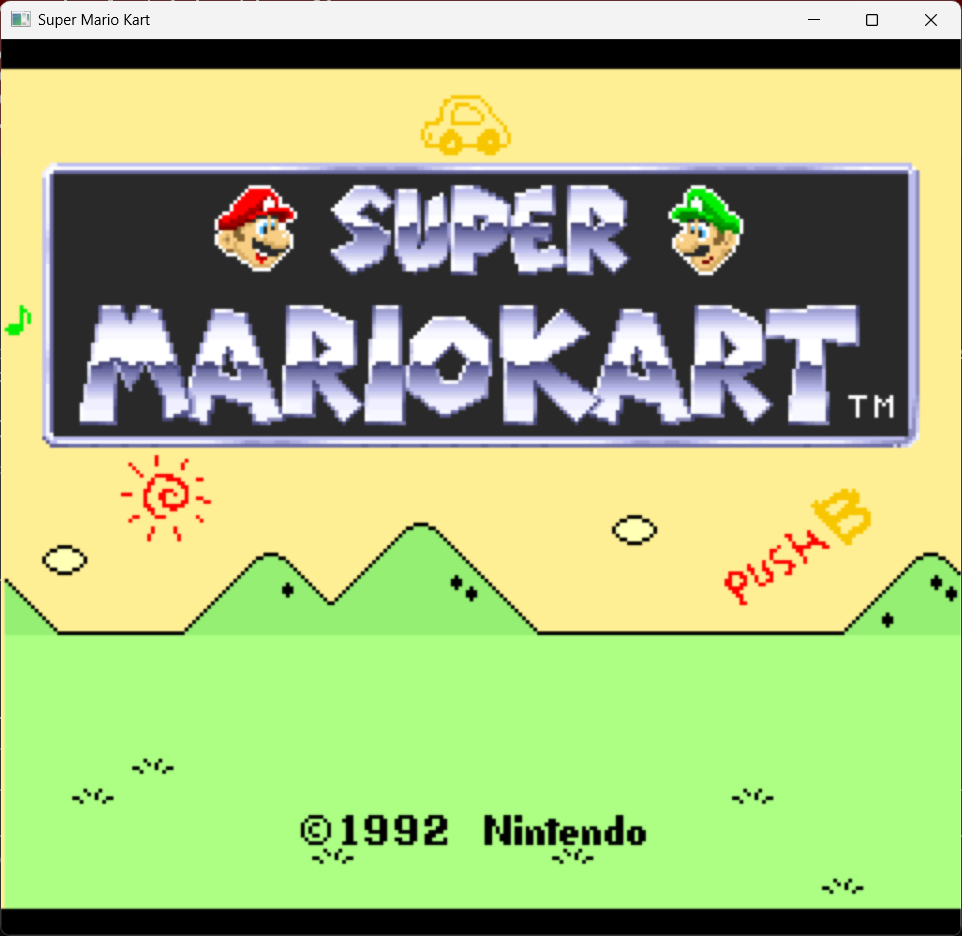

# Super Mario Kart — Static Recompilation

Static recompilation of **Super Mario Kart** (SNES, 1992) from WDC 65C816 assembly to native C code, playable on modern hardware via SDL2.

Part of the [sp00nznet](https://github.com/sp00nznet) recompilation portfolio. This is the first SNES (65816 CPU) target in the series.

## Status

**28 recompiled functions** — game boots, runs the full initialization chain, transitions to the title screen, and renders BG layers + palettes with real SNES hardware via LakeSnes.



### What works
- Full boot chain: reset vector → hardware init → WRAM clear → PPU/APU/DSP-1 setup
- NMI handler with state dispatch, brightness fading, OAM DMA
- Main loop with state machine (idle → init → title screen)
- Custom tile/tilemap decompressor ($84:E09E) — all 7 compression modes + E0+ extended counts
- Title screen transition: PPU register setup, VRAM tile/tilemap loading, palette decompression
- Real palette data loaded from ROM → CGRAM (256 colors)
- All 3 BG layers rendering correctly (Mode 1: title banner, hills, text)
- Sprite tile DMA to VRAM (2bpp→4bpp interleave + block transfers)
- LakeSnes PPU renders all 224 scanlines per frame
- SDL2 window at 768×672 (3× scale), 60fps vsync, keyboard input

### What's next
- Sprite animation system (title screen character karts — complex multi-slot state machine)
- HDMA scroll effects (animated stripe background)
- Title screen interactivity (menu selection, mode transitions)
- Race screen (Mode 7, DSP-1 math, full gameplay)

## Architecture

```
┌─────────────────────────────────────────────────┐
│                 smk_launcher                      │
│  ┌──────────────────────────────────────────┐    │
│  │  src/recomp/ — 26 Recompiled functions   │    │
│  │  smk_boot.c  — NMI, state machine, fade  │    │
│  │  smk_init.c  — Init, transition dispatch │    │
│  │  smk_title.c — Decompressor, PPU setup   │    │
│  └──────────────────────────────────────────┘    │
│                       │                           │
│              bus_read8 / bus_write8               │
│                       │                           │
│  ┌──────────────────────────────────────────┐    │
│  │  snesrecomp (ext/snesrecomp/)            │    │
│  │  ┌────────────────────────────────────┐  │    │
│  │  │  LakeSnes — Cycle-accurate SNES HW │  │    │
│  │  │  Real PPU (Mode 0-7, sprites, etc) │  │    │
│  │  │  Real SPC700 + DSP audio           │  │    │
│  │  │  Real DMA (GPDMA + HDMA)           │  │    │
│  │  │  Full memory bus routing            │  │    │
│  │  └────────────────────────────────────┘  │    │
│  │  SDL2 platform (window, audio, input)    │    │
│  └──────────────────────────────────────────┘    │
└─────────────────────────────────────────────────┘
```

Recompiled game code acts as the CPU — it calls `bus_read8(bank, addr)` / `bus_write8(bank, addr, val)` which route through LakeSnes's real memory bus to the actual PPU, APU, DMA, and cartridge hardware. The PPU renders scanlines, the APU processes audio, and DMA transfers happen exactly as on real hardware.

## Recompiled Functions (28)

| Address | Function | Description |
|---------|----------|-------------|
| `$80:FF70` | `smk_80FF70` | Reset vector — boot entry point |
| `$80:803A` | `smk_80803A` | Hardware init (PPU, APU, WRAM, DMA) |
| `$80:8056` | `smk_808056` | Main loop (state dispatch) |
| `$80:8000` | `smk_808000` | NMI handler (OAM DMA, scroll, brightness) |
| `$80:B181` | `smk_80B181` | Brightness fade in/out |
| `$80:946E` | `smk_80946E` | OAM DMA transfer (WRAM → PPU) |
| `$80:81B5` | `smk_8081B5` | NMI cleanup (audio, input) |
| `$80:8067` | `smk_808067` | State $02 handler (init trigger) |
| `$80:80BA` | `smk_8080BA` | State $04 handler (title screen loop) |
| `$80:8096` | `smk_808096` | Null state handler (states $00/$1A) |
| `$80:81DD` | `smk_8081DD` | NMI state $00/$1A (wake main loop) |
| `$80:8237` | `smk_808237` | NMI state $04 (title screen NMI) |
| `$80:8BEA` | `smk_808BEA` | PPU register init + font tile DMA |
| `$81:E000` | `smk_81E000` | Full init (WRAM clear, PPU, DSP-1, state vars) |
| `$81:E067` | `smk_81E067` | Transition dispatch (indexed by DP $32) |
| `$81:E0AD` | `smk_81E0AD` | Title screen transition |
| `$81:E50D` | `smk_81E50D` | Title PPU register setup |
| `$81:E10A` | `smk_81E10A` | Tile data decompression |
| `$81:E118` | `smk_81E118` | Tilemap decompression |
| `$81:E584` | `smk_81E584` | Additional data decompression |
| `$81:E576` | `smk_81E576` | Sprite tile decompression + 2bpp→4bpp interleave |
| `$81:E933` | `smk_81E933` | VRAM DMA transfers |
| `$84:E09E` | `smk_84E09E` | Custom decompressor (7 modes + E0+ extended) |
| `$84:F38C` | `smk_84F38C` | PPU/display reset |
| `$84:FCF1` | `smk_84FCF1` | SRAM checksum validation |
| `$85:8000` | `smk_858000` | Sprite/palette/OAM setup |
| `$85:8045` | `smk_858045` | Per-frame sprite update |
| `$85:809B` | `smk_85809B` | BG scroll + HDMA trigger |

## Building

### Prerequisites
- CMake 3.16+
- Visual Studio 2022 (MSVC)
- SDL2 via vcpkg: `vcpkg install sdl2:x64-windows`
- Python 3.10+ (for disassembler and analysis tools)

### Build

```bash
cmake -B build -G "Visual Studio 17 2022" -A x64 \
  -DCMAKE_TOOLCHAIN_FILE=C:/vcpkg/scripts/buildsystems/vcpkg.cmake

cmake --build build --config Debug
```

### Run

```bash
build/Debug/smk_launcher.exe "Super Mario Kart (USA).sfc"
```

The ROM file is not included — supply your own US v1.0 copy (MD5: `7f25ce5a283d902694c52fb1152fa61a`).

## Decompressor

The custom decompressor at `$84:E09E` handles SMK's tile/tilemap compression format:

| Mode | Encoding | Description |
|------|----------|-------------|
| `$00` | Raw | Copy N bytes from stream |
| `$20` | RLE | Repeat 1 byte N times |
| `$40` | Word fill | Alternate 2 bytes for N entries |
| `$60` | Inc fill | Store incrementing byte N times |
| `$80` | Backref | Copy from earlier in buffer (abs offset + base) |
| `$A0` | Inv backref | Copy with XOR $FF (inverted) |
| `$C0` | Byte backref | Copy from buf_pos - offset (1-byte offset) |

Commands `$E0`–`$FE` use extended 10-bit counts: 1 data byte + cmd bits 0-1 as high bits.

## Project Structure

```
├── include/smk/       cpu_ops.h (65816 instruction helpers), functions.h
├── src/
│   ├── recomp/        Recompiled game functions (smk_boot.c, smk_init.c, smk_title.c)
│   └── main/          main.c — entry point, frame loop
├── ext/snesrecomp/    snesrecomp library (LakeSnes backend + SDL2 platform)
└── tools/
    ├── disasm/        65816 disassembler (M/X flag tracking, all addressing modes)
    └── mesen/         Mesen2 trace scripts + parsers
```

## ROM Details

| Field | Value |
|-------|-------|
| Title | SUPER MARIO KART |
| System | Super Nintendo (SNES) |
| CPU | WDC 65C816 @ 3.58 MHz |
| Coprocessor | DSP-1 (math) + SPC700 (audio) |
| Mapping | HiROM FastROM |
| Size | 512 KB (8 × 64 KB banks, C0–C7) |
| SRAM | 2 KB |
| Region | USA |
| CRC32 | CD80DB86 |

## Key References

- [Yoshifanatic1/Super-Mario-Kart-Disassembly](https://github.com/Yoshifanatic1/Super-Mario-Kart-Disassembly) — Full 65816 + SPC700 disassembly (Asar)
- [jvipond/super_mario_kart_disassembly](https://github.com/jvipond/super_mario_kart_disassembly) — Trace-based disassembly with Python tooling
- [jvipond/super_mario_kart_recompilation](https://github.com/jvipond/super_mario_kart_recompilation) — Prior LLVM-based recomp attempt
- [MrL314/smk-spc700-disassembly](https://github.com/MrL314/smk-spc700-disassembly) — SPC700 audio driver disassembly
- [LakeSnes](https://github.com/elzo-d/LakeSnes) — Cycle-accurate SNES emulator in C (hardware backend)

## License

This project contains no Nintendo copyrighted material. The ROM file is not included and must be legally obtained by the user.
