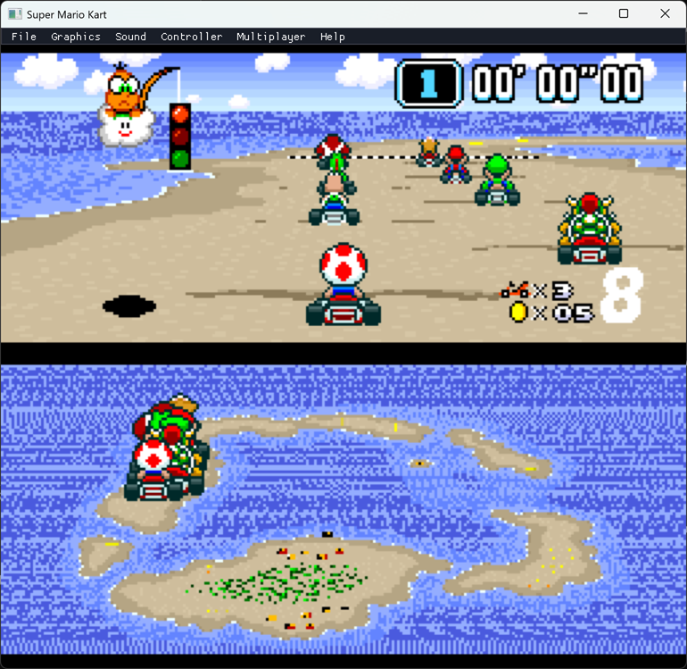
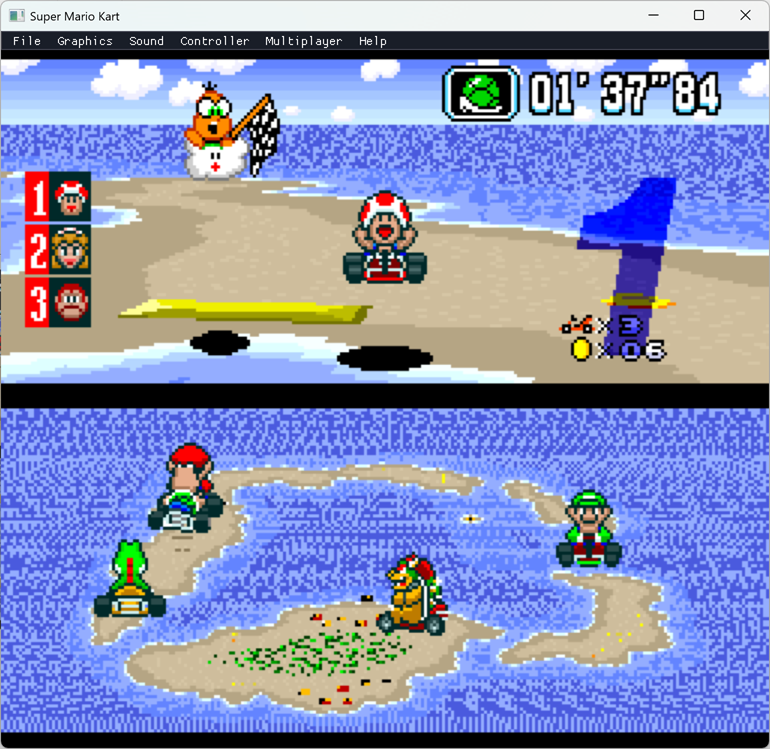
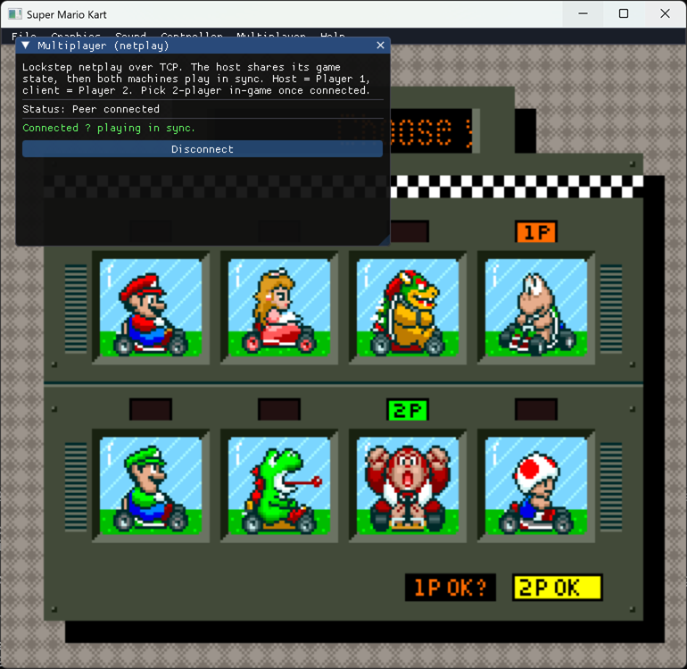

# Super Mario Kart — Static Recompilation

Static recompilation of **Super Mario Kart** (SNES, 1992) from WDC 65C816 assembly to native C code, playable on modern hardware via SDL2.

Part of the [sp00nznet](https://github.com/sp00nznet) recompilation portfolio. This is the first SNES (65816 CPU) target in the series.

## Status

**Playable end-to-end.** A cold boot walks the authentic flow from controller input —
title → driver select → 50cc class / cup select → a live **Mode-7 race** — with a Dear
ImGui menu bar, save-states, configurable keyboard + gamepad controls for two players, and
**lockstep netplay**. The SNES hardware (PPU Modes 0–7, SPC700 + DSP audio, DMA/HDMA, DSP-1
coprocessor) is fully emulated by the LakeSnes backend.

Two execution paths share the same backend: **real-frame mode** (the default) runs the
genuine ROM through LakeSnes's cycle-accurate frame, so the whole game plays today; the
**recompiled-shell path** (`SMK_SHELLS=1`) runs hand-written `RECOMP_PATCH` functions and is
where the static-recompilation work grows incrementally. Recompiled functions are defined
with `RECOMP_PATCH(name, snes_addr) { ... }` and auto-register in snesrecomp's dispatch table
at static-init time — adding a translated function is a one-line change, no central list.


The full menu flow runs from controller input — title → driver select → class/cup select:


The Mode-7 race renders and plays — perspective track, karts, HUD, split-screen:




**Lockstep netplay** — two machines run the same deterministic emulation in sync (host =
Player 1, client = Player 2), starting from a shared save-state:



A Dear ImGui menu bar (File / Graphics / Sound / Controller / Multiplayer / Help) overlays the game — see [Menu](#menu).

### What works
- **Full authentic flow from controller input** — title → driver select → 50cc class / cup
  select → Mode-7 race, all driven by the genuine ROM's state sequencer (`$81:E000`)
- **Mode-7 race** rendering + gameplay: perspective track, karts, HUD, lap timer, split-screen
- **Dear ImGui menu** overlaying the game — File / Graphics / Sound / Controller / Multiplayer / Help
- **Save-states** — File → Save/Load (and F5/F8), full machine state via LakeSnes; File → New resets
- **Configurable input** for **both players** — rebind keyboard *and* Xbox-style gamepad per button
- **Lockstep netplay** (TCP) with input-delay buffering — host/join, save-state sync on connect,
  deterministic in-sync emulation (verified by matching WRAM checksums)
- Full boot chain: reset vector → hardware init → WRAM 0x55 fill → PPU/APU/DSP-1 setup → Mode-7 tables
- Custom tile/tilemap decompressor (`$84:E09E`) — all 7 compression modes + E0+ extended counts
- Joypad/auto-joypad input with edge detection; real palettes ROM → CGRAM; per-scanline HDMA
- LakeSnes renders all PPU scanlines per frame; SDL2 window (3× scale by default), 60 fps, audio

### What's next
- **Grow the recompiled-shell path** (`SMK_SHELLS=1`) to drive gameplay — currently the shells
  render the menus but the Mode-7 race's multi-frame init/fade-in needs the real frame
  (the default real-frame path handles it). See `docs/smk_flow_re.md`.
- Netplay polish: rollback / over-the-wire desync detection; "drop straight into 2-player on connect"
- More recompiled functions (the long-term goal: replace real-frame with recompiled C)

### Recent (June 2026)
- **Cracked the menu→race flow** — root-caused the long-standing menu blocker to a power-on
  WRAM fill (`$2E` game-mode read as 2-player on a zero-filled RAM); fixed with a `0x55` fill
  matching hardware/snes9x. Full RE writeup in [`docs/smk_flow_re.md`](docs/smk_flow_re.md),
  cracked headlessly via a BizHawk + snes9x-core harness (`tools/bizhawk/`).
- **Real-frame mode** — runs the genuine ROM via LakeSnes's full frame so the whole game plays now.
- **ImGui menu, save-states, 2-player input, and lockstep netplay** added to snesrecomp (generic).
- **Fixed a real `s_pixel_buf` overflow** (478 vs 480 rows) that silently zeroed adjacent statics.

### Earlier
- **Auto-registered dispatch** via `RECOMP_PATCH(name, snes_addr) { ... }` — linker-priority static
  constructors, no central list. Pattern inspired by N64Recomp's `RECOMP_PATCH`.
- **Public 65816 op kit** — `<snesrecomp/cpu_ops.h>` (`op_lda_*`, `op_sta_*`, `op_rep`, …).

## Architecture

```
┌─────────────────────────────────────────────────┐
│                 smk_launcher                      │
│  ┌──────────────────────────────────────────┐    │
│  │  src/recomp/ — 48 Recompiled functions   │    │
│  │  smk_boot.c  — NMI, state machine, input │    │
│  │  smk_init.c  — Init, transition dispatch │    │
│  │  smk_title.c — Decompressor, PPU, menus  │    │
│  └──────────────────────────────────────────┘    │
│                       │                           │
│              bus_read8 / bus_write8               │
│                       │                           │
│  ┌──────────────────────────────────────────┐    │
│  │  snesrecomp (ext/snesrecomp/)            │    │
│  │  ┌────────────────────────────────────┐  │    │
│  │  │  LakeSnes — Cycle-accurate SNES HW │  │    │
│  │  │  Real PPU (Mode 0-7, sprites, etc) │  │    │
│  │  │  Real SPC700 + DSP audio           │  │    │
│  │  │  Real DMA (GPDMA + HDMA)           │  │    │
│  │  │  Full memory bus routing            │  │    │
│  │  └────────────────────────────────────┘  │    │
│  │  SDL2 platform (window, audio, input)    │    │
│  └──────────────────────────────────────────┘    │
└─────────────────────────────────────────────────┘
```

In the **recompiled-shell path** (`SMK_SHELLS=1`), recompiled game code acts as the CPU — it
calls `bus_read8(bank, addr)` / `bus_write8(bank, addr, val)`, which route through LakeSnes's
real memory bus to the actual PPU, APU, DMA, and cartridge hardware. In the **default
real-frame path**, LakeSnes's own CPU executes the genuine ROM each frame (`snes_runFrame`)
— identical to a cycle-accurate emulator — so the full game plays while the recompiled
functions are still being written. Either way, all PPU/APU/DMA behaviour is real.

## Controls

Default Player 1 keyboard (rebindable in the menu):

| Key | SNES Button |
|-----|-------------|
| Arrow keys | D-pad |
| Z | B |
| X | Y |
| A | A |
| S | X |
| Q | L |
| W | R |
| Enter | Start |
| Right Shift | Select |
| F5 / F8 | Save / Load state |
| Escape | Quit |

**Gamepads** (Xbox-style, via SDL_GameController) work out of the box for both
players — A→B, B→A, X→Y, Y→X, shoulders→L/R, Back→Select, Start→Start, d-pad and
left stick steer. Rebind any of it in **Controller** (P1/P2 tabs).

## Menu

A Dear ImGui menu bar (modelled on [LinksAwakening](https://github.com/sp00nznet/LinksAwakening))
overlays the game:

- **File** — New (reset/restart), Save / Load state (`smk_state.sav`; also **F5 / F8**),
  Settings ▸ (save/load `smk_config.ini`), Quit
- **Graphics** — window scale, V-Sync, texture filter, scanlines, show FPS
- **Sound** — master volume, mute
- **Controller** — rebind keyboard **and** gamepad for **Player 1 and Player 2**
- **Multiplayer** — Host / Join (IP:port), input-delay, connection status — lockstep netplay
- **Help → About** — links back to this repository

The menu auto-disables in headless/scripted runs (`SMK_HEADLESS`/`SMK_SCRIPT`).

## Building

### Prerequisites
- CMake 3.16+
- Visual Studio 2022 (MSVC)
- SDL2 via vcpkg: `vcpkg install sdl2:x64-windows`
- Python 3.10+ (for disassembler and analysis tools)

### Build

```bash
cmake -B build -G "Visual Studio 17 2022" -A x64 \
  -DCMAKE_TOOLCHAIN_FILE=C:/vcpkg/scripts/buildsystems/vcpkg.cmake

cmake --build build --config Debug
```

### Run

```bash
build/Debug/smk_launcher.exe
```

The ROM file is not included — supply your own US v1.0 copy (MD5: `7f25ce5a283d902694c52fb1152fa61a`).

By default the launcher runs in **real-frame mode** — the genuine ROM via LakeSnes's
full cycle-accurate frame — so menus *and* the Mode-7 race render and play at full
speed out of the box. (The recompiled per-frame shells can't yet drive the race's
multi-frame setup; as gameplay functions are recompiled they take over.)

For recompilation development, use the recompiled-shell path:

```bash
SMK_SHELLS=1 build/Debug/smk_launcher.exe           # recompiled per-frame shells
```

## Decompressor

The custom decompressor at `$84:E09E` handles SMK's tile/tilemap compression format:

| Mode | Encoding | Description |
|------|----------|-------------|
| `$00` | Raw | Copy N bytes from stream |
| `$20` | RLE | Repeat 1 byte N times |
| `$40` | Word fill | Alternate 2 bytes for N entries |
| `$60` | Inc fill | Store incrementing byte N times |
| `$80` | Backref | Copy from earlier in buffer (abs offset + base) |
| `$A0` | Inv backref | Copy with XOR $FF (inverted) |
| `$C0` | Byte backref | Copy from buf_pos - offset (1-byte offset) |

Commands `$E0`–`$FE` use extended 10-bit counts: 1 data byte + cmd bits 0-1 as high bits.

## Project Structure

```
├── include/smk/       functions.h (smk_XXXXXX forward declarations)
├── src/
│   ├── recomp/        Recompiled game functions (smk_boot.c, smk_init.c, smk_title.c)
│   └── main/          main.c — entry point, frame loop
├── ext/snesrecomp/    snesrecomp library (LakeSnes backend + SDL2 platform):
│                        recomp_patch.h    — RECOMP_PATCH auto-registration macro
│                        cpu_ops.h         — 65816 instruction helpers (op_lda_*, op_sta_*, …)
│                        menu_overlay.cpp  — Dear ImGui menu (File/Graphics/Sound/Controller/MP/Help)
│                        mp_session.c      — generic SNES lockstep netplay (TCP)
│                        third_party/imgui — vendored Dear ImGui
├── docs/
│   └── smk_flow_re.md  reverse-engineering of the menu→race flow
└── tools/
    ├── disasm/        65816 disassembler (M/X flag tracking, all addressing modes)
    ├── bizhawk/       headless BizHawk + snes9x-core ground-truth harness
    └── lakesnes_ref.c native LakeSnes runner (scripted input, snapshot/BMP dumps)
```

## ROM Details

| Field | Value |
|-------|-------|
| Title | SUPER MARIO KART |
| System | Super Nintendo (SNES) |
| CPU | WDC 65C816 @ 3.58 MHz |
| Coprocessor | DSP-1 (math) + SPC700 (audio) |
| Mapping | HiROM FastROM |
| Size | 512 KB (8 × 64 KB banks, C0–C7) |
| SRAM | 2 KB |
| Region | USA |
| CRC32 | CD80DB86 |

## Key References

- [Yoshifanatic1/Super-Mario-Kart-Disassembly](https://github.com/Yoshifanatic1/Super-Mario-Kart-Disassembly) — Full 65816 + SPC700 disassembly (Asar)
- [jvipond/super_mario_kart_disassembly](https://github.com/jvipond/super_mario_kart_disassembly) — Trace-based disassembly with Python tooling
- [jvipond/super_mario_kart_recompilation](https://github.com/jvipond/super_mario_kart_recompilation) — Prior LLVM-based recomp attempt
- [MrL314/smk-spc700-disassembly](https://github.com/MrL314/smk-spc700-disassembly) — SPC700 audio driver disassembly
- [LakeSnes](https://github.com/elzo-d/LakeSnes) — Cycle-accurate SNES emulator in C (hardware backend)

## License

This project contains no Nintendo copyrighted material. The ROM file is not included and must be legally obtained by the user.
